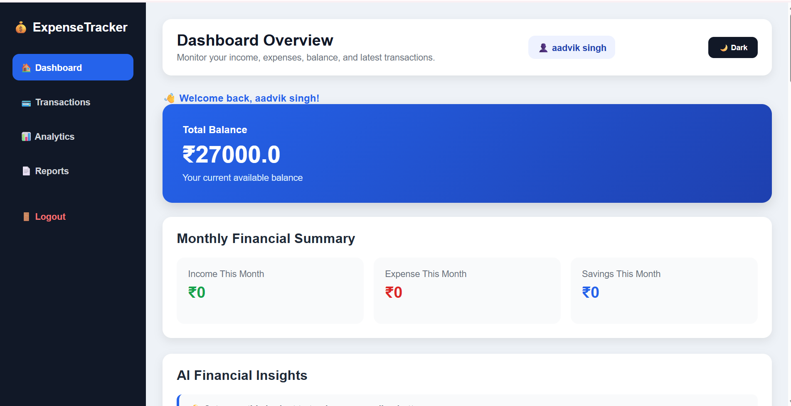
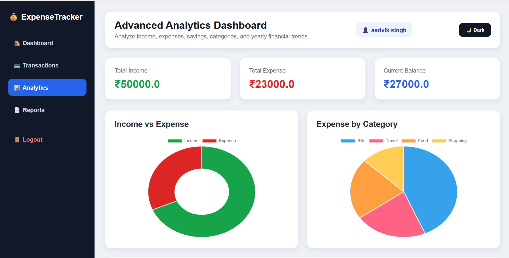

# 💰 Personal Expense Tracker Dashboard

A modern, full-stack Personal Expense Tracker Dashboard built with **Python, Flask, SQLite, Chart.js, HTML, CSS, and JavaScript**. The application helps users efficiently manage their personal finances with budgeting, analytics, AI-powered insights, recurring transactions, bill reminders, and interactive dashboards.

---

## 📸 Project Preview

> Add screenshots here after uploading them.

| Dashboard | Analytics |
|-----------|-----------|
|  |  |

---

# 🚀 Features

### 👤 User Authentication
- Secure User Registration
- Login & Logout
- Password Hashing
- Session Management

### 💸 Transaction Management
- Add Transactions
- Edit Transactions
- Delete Transactions
- Search Transactions
- Filter by Category
- Filter by Type
- Date Range Filter
- Sorting Options

### 📊 Dashboard
- Total Income
- Total Expense
- Current Balance
- Total Transactions
- Monthly Financial Summary
- Recent Transactions

### 📈 Advanced Analytics
- Income vs Expense Chart
- Expense by Category
- Monthly Income Trend
- Monthly Expense Trend
- Monthly Income vs Expense Comparison
- Monthly Savings Trend
- Yearly Income vs Expense Analysis

### 💰 Budget Planner
- Monthly Budget Setting
- Budget Progress
- Remaining Budget
- Budget Status
- Budget Progress Bar

### 🎯 Savings Goal Tracker
- Set Savings Goal
- Track Current Savings
- Remaining Goal Amount
- Savings Progress

### 🔄 Recurring Transactions
- Monthly Salary
- Rent
- Subscription Payments
- Weekly Expenses
- Automatic Recurring Records

### 🔔 Bill Reminder System
- Upcoming Bills
- Due Today
- Overdue Bills
- Mark Bill as Paid
- Delete Bill Reminder

### 🤖 AI Financial Insights
- Budget Suggestions
- Spending Analysis
- Saving Recommendations
- Category Insights
- Expense Warnings

### 🤖 AI Spending Predictions
- Monthly Expense Prediction
- Spending Trend Analysis
- Budget Risk Detection
- Financial Recommendations

### 📅 Calendar View
- Transactions by Date
- Bill Reminder Calendar
- Daily Expense Tracking

### 📄 Reports
- Export to PDF
- Export to Excel
- Export to CSV
- Print Reports

### 🌙 User Experience
- Responsive Design
- Dark Mode
- Modern Dashboard UI
- Interactive Charts

---

# 🛠️ Tech Stack

### Backend
- Python
- Flask
- SQLite

### Frontend
- HTML5
- CSS3
- JavaScript
- Chart.js

### Libraries
- OpenPyXL
- ReportLab
- Werkzeug
- Gunicorn

---

# 📂 Project Structure

```text
personal-expense-tracker-dashboard/
│
├── app.py
├── requirements.txt
├── Procfile
├── README.md
│
├── database/
│   └── expense.db
│
├── static/
│   └── style.css
│
├── templates/
│   ├── base.html
│   ├── dashboard.html
│   ├── analytics.html
│   ├── transactions.html
│   ├── reports.html
│   ├── calendar.html
│   ├── edit.html
│   ├── login.html
│   └── register.html
│
└── screenshots/
```

---

# ⚙️ Installation

Clone the repository

```bash
git clone https://github.com/yourusername/personal-expense-tracker-dashboard.git
```

Move into the project

```bash
cd personal-expense-tracker-dashboard
```

Create Virtual Environment

```bash
python -m venv venv
```

Activate Environment

Windows

```bash
venv\Scripts\activate
```

Install dependencies

```bash
pip install -r requirements.txt
```

Run the application

```bash
python app.py
```

Open

```
http://127.0.0.1:5000
```

---

# 📊 Key Highlights

- Full Authentication System
- CRUD Operations
- Data Visualization
- Financial Analytics
- AI-Based Insights
- Budget Tracking
- Savings Management
- Bill Reminder System
- Calendar View
- Report Generation
- Responsive UI

---

# 🎯 Future Enhancements

- Email Notifications
- SMS Reminders
- Cloud Database Support
- Multi-Currency Support
- OCR Receipt Scanner
- Mobile Application
- Machine Learning Expense Forecasting
- Google Calendar Integration

---

# 📸 Screenshots

Add screenshots here after uploading your project images.

- Dashboard
- Analytics
- Budget Planner
- Bill Reminder
- Calendar View
- Reports

---

# 👨‍💻 Author

**Aadvik Singh**

Electronics & Communication Engineering

Python | Flask | Data Analytics | Dashboard Development

GitHub: https://github.com/Aadvik7462


# ⭐ Support

If you like this project, consider giving it a ⭐ on GitHub.

---

# 📜 License

This project is licensed under the MIT License.